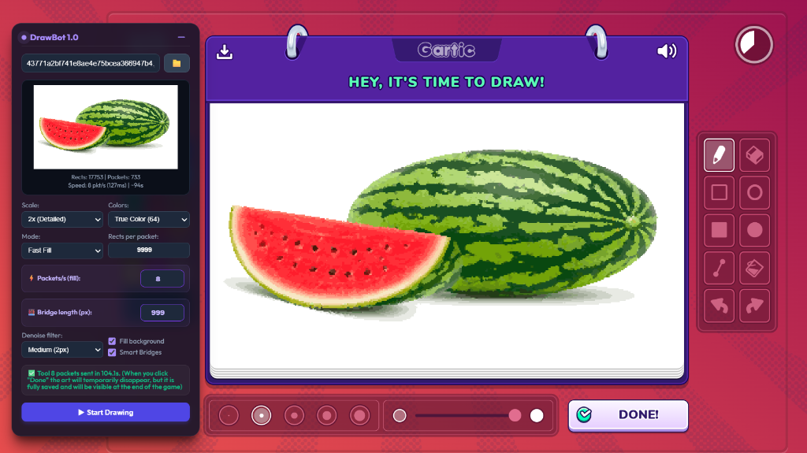

# 🎨 DrawBot for Gartic Phone

> **Automated drawing bot for [Gartic Phone](https://garticphone.com) — converts any image into in-game art via WebSocket packet injection.**



**Language / Язык:**  [English](#english) | [Русский](#русский)

---

<a id="english"></a>

# 🇬🇧 English

## Table of Contents

- [Features](#features)
- [Requirements](#requirements)
- [Installation](#installation)
- [Usage](#usage)
- [Settings Reference](#settings-reference)
- [Tips & Recommendations](#tips--recommendations)
- [How It Works](#how-it-works)

---

## Features

- 🖼 **Image-to-drawing conversion** — load any image (file or URL) and the bot draws it on the Gartic Phone canvas
- ⚡ **Fast Fill mode** — uses the game's native fill tool (Tool 8) for significantly faster drawing
- 🎨 **Flexible color modes** — Gartic palette (18 colors), True Color quantization (8–64 colors), or unlimited colors
- 🌉 **Smart Bridges** — automatically connects isolated color islands to reduce network packets
- 📊 **Live preview** — see the quantized/downscaled result before drawing
- ⏸ **Pause / Cancel** — full control during the drawing process
- 📈 **Progress bar** — real-time progress with estimated time remaining
- 💾 **Persistent settings** — all settings are saved to `localStorage`
- 🖱 **Draggable UI panel** — glassmorphism-styled panel with minimize support

---

## Requirements

- A modern browser (Chrome, Firefox, Edge, Opera)
- **[Tampermonkey](https://www.tampermonkey.net/)** browser extension (or any UserScript manager: Violentmonkey, Greasemonkey, etc.)

---

## Installation

### Step 1 — Install Tampermonkey

1. Go to [tampermonkey.net](https://www.tampermonkey.net/)
2. Click **Download** for your browser and install the extension.

### Step 2 — Enable Developer Mode & Allow User Scripts (Crucial for Manifest V3)

To allow UserScripts to run in modern browsers:
1. Open your browser's extensions page (e.g., `chrome://extensions` in Chrome, `edge://extensions` in Edge).
2. Toggle the **Developer Mode** switch in the top-right corner to **ON**.
3. Click on the **Details** (Details / Подробнее) button of your UserScript manager extension (e.g., Tampermonkey).
4. Locate the **Allow User Scripts** (Разрешить пользовательские скрипты) toggle and switch it to **ON**.
5. *If prompted*, grant any necessary permissions.

### Step 3 — Install the Script

You can install the script automatically with a single click:
1. Click this link: **[Install GarticPhoneDrawBot.user.js (One-Click)](https://raw.githubusercontent.com/notlun1x/Gartic-Phone-Auto-Draw/main/GarticPhoneDrawBot.user.js)**.
2. Tampermonkey will automatically open a tab displaying the script.
3. Click the **Install** (or **Update**) button.

*(Alternatively, you can create a new script in the Tampermonkey dashboard, copy the contents of [GarticPhoneDrawBot.user.js](GarticPhoneDrawBot.user.js), paste them into the editor, and press Ctrl+S).*

---

## Usage

### Quick Start

1. **Open Gartic Phone** and join/create a game
2. **Wait for the drawing round** — the bot panel will show `Socket ready` once the WebSocket is captured
3. **Load an image**:
   - Click the 📁 button to upload a local file, **or**
   - Paste an image URL into the text field
4. **Adjust settings** (scale, colors, mode) and check the live preview
5. **Click ▶ Start Drawing** — the bot begins sending packets to the game server
6. Wait for completion, or use **⏸ Pause** / **⏹ Cancel** at any time

### Important Notes

- ⚠️ **Make at least one manual brush stroke** on the canvas before starting the bot. This is needed to initialize the WebSocket connection
- After the bot finishes and you click "Done" in the game, the art may temporarily disappear from your screen — **this is normal**. The drawing is fully saved on the server and will be visible at the end of the game
- If the socket isn't detected, try refreshing the page and drawing a stroke manually again

---

## Settings Reference

| Setting | Description | Recommended |
|---|---|---|
| **Scale** | Downscale factor for the image. Higher = fewer pixels = faster, but lower quality | 3x–4x |
| **Colors** | Color quantization mode. `Gartic palette (18)` uses only the game's built-in colors; `True Color (N)` finds the optimal N colors via quantization | True Color (8) |
| **Mode** | `Fast Fill` uses Tool 8 (fill rectangles) — much faster. `Standard Lines` uses Tools 1/6 (pen strokes and rectangles) — slower but more compatible | Fast Fill |
| **Rects per packet** | Max rectangles bundled in a single WebSocket frame (Fast Fill only) | 3000 |
| **Packet delay (ms)** | Delay between packets in Standard Lines mode | 127 |
| **⚡ Packets/s (fill)** | Rate limiter for Fast Fill mode. Going above 8 risks server-side packet drops | 8 |
| **Denoise filter** | Removes isolated noisy pixels from the quantized image | Off or Weak |
| **Fill background** | Flood-fills the entire canvas with the most common color first, then skips it during drawing | ✅ On |
| **Smart Bridges** | Connects isolated color islands via short pixel bridges to reduce the number of packets | ✅ On |
| **🌉 Bridge length (px)** | Max pixel distance for smart bridge connections | 50 |

---

## Tips & Recommendations

1. **For best quality:** use Scale 2x–3x + True Color (16–32) — gives rich detail but takes longer
2. **For speed:** use Scale 5x+ or Gartic palette + Fast Fill — draws in seconds
3. **If the art looks too "noisy":** enable the Denoise filter (Weak or Medium)
4. **If drawing drops packets:** lower the Packets/s value (try 6–7) or increase the scale
5. **If the image has many isolated small details:** enable Smart Bridges and increase bridge length (up to 100)
6. **Minimize the panel** with the ➖ button while the bot is drawing to reduce visual clutter

---

## How It Works

### Architecture Overview

DrawBot is a Tampermonkey UserScript that operates entirely client-side, injecting itself into the Gartic Phone web page. It works by:

1. **Intercepting the WebSocket connection** to the game server
2. **Processing images** into a pixel grid with color quantization
3. **Generating optimized drawing commands** (rectangles and strokes)
4. **Sending packets** directly through the captured WebSocket

### WebSocket Interception

The script patches `WebSocket.prototype.send` at `document-start` (before the game loads). When Gartic Phone opens a WebSocket connection, DrawBot captures the instance and begins monitoring all traffic:

- **Socket prefix detection** — the game's internal channel ID is dynamically captured from outgoing messages (e.g., `42[2,7,`), ensuring compatibility even when the protocol changes
- **Turn ID synchronization** — the bot intercepts both incoming and outgoing packets to track the current `turnNum`, which is required in every drawing packet
- **Stroke ID tracking** — each drawing action has a sequential `strokeId`. The bot monitors user strokes and syncs its counter to prevent ID collisions

### Image Processing Pipeline

1. **Downscaling** — the image is scaled to a grid of `768/step × 448/step` pixels (where `step` is the Scale setting)
2. **Color quantization** — depending on the mode:
   - *Gartic palette*: maps each pixel to the nearest of 18 fixed game colors using weighted Euclidean distance (redmean formula)
   - *True Color (N)*: runs a custom quantization algorithm (frequency-sorted clustering + 3 K-Means refinement iterations) to find the best N colors
   - *Unlimited*: uses all unique colors as-is
3. **Denoising** (optional) — isolated pixels surrounded by fewer than `threshold` same-color neighbors are replaced with the most common neighboring color
4. **Preview rendering** — the quantized grid is drawn to an off-screen canvas and displayed in the UI

### Drawing Engine

#### Fast Fill Mode (Tool 8)

This is the primary and fastest drawing mode. It works by:

1. **Background flood fill** — the most common color fills the entire canvas first (one packet)
2. **Color ordering** — remaining colors are sorted by their island count (most fragmented first), which is optimal for the bridging algorithm
3. **Per-color processing**:
   - A binary grid (0/1) is created for each color
   - **Smart Bridges** (`applyBridging`) — a multi-source BFS finds short paths between disconnected islands of the same color. Bridge pixels temporarily overwrite other colors, which are guaranteed to be repainted in later iterations. This uses Union-Find for efficient component merging
   - **Maximal rectangle decomposition** (`findMaximalRectangleOpt`) — for each pixel region, the algorithm finds the largest possible rectangle using a dual-strategy approach (expand right-then-down vs. down-then-right) and picks the one with greater area
   - **DFS tree construction** (`buildRectangleTreeDFS`) — rectangles are linked in a parent-child tree via DFS traversal. Each new rectangle is connected to the rectangle that spawned it. This preserves spatial adjacency, which is critical for the game's packet validation
   - **Packet chunking** (`splitIntoChunks`) — the rectangle tree is serialized into WebSocket frames. Each frame stays under the 500,000-character limit. When a new disconnected island begins, the packet is force-split with `parentIndex = 0`

4. **Rate-limited sending** — packets are sent at the configured PPS rate using a Web Worker-based timer (accurate even in background tabs). A delta-sleep algorithm compensates for DOM update overhead to maintain a steady ~7.9 packets/s at the default setting

#### Standard Lines Mode (Tools 1 & 6)

A fallback mode that uses pen strokes and rectangles:

1. **Rectangle extraction** (`findMaxRectangles`) — finds maximal rectangles ≥ 2×2 in the color grid
2. **Path tracing** (`findPaths`) — remaining single-pixel lines are traced with directional momentum (prefers continuing the same direction). Paths are simplified via collinearity check (`simplifyPath`)
3. **Packet sending** — rectangles → Tool 6 packets, paths → Tool 1 (pen start + delta-move) packets

### Network Protocol

Each drawing packet follows this format:
```
42[channelId,7,{"t":turnId,"d":actionType,"v":[toolId, strokeId, [color, thickness, 10], ...data]}]
```

- **Tool 1** — pen stroke (start point + deltas)
- **Tool 6** — rectangle (two corner points)
- **Tool 8** — fill (color + array of rectangles with parent indices)

### Timing & Safety

- **Web Worker timers** — a dedicated Worker runs `setTimeout` to avoid browser throttling of inactive tabs
- **PPS limiter** — adds a +2ms safety buffer to the base interval to stay within server limits
- **Delta-sleep** — dynamically adjusts delay based on actual elapsed time since the last packet
- **Canvas hash verification** — after sending the first Tool 8 packet, the bot samples the game canvas to detect whether the fill tool is actually working

---

<a id="русский"></a>

# 🇷🇺 Русский

## Содержание

- [Возможности](#возможности)
- [Требования](#требования)
- [Установка](#установка)
- [Использование](#использование)
- [Описание настроек](#описание-настроек)
- [Советы и рекомендации](#советы-и-рекомендации)
- [Как работает бот](#как-работает-бот)

---

## Возможности

- 🖼 **Конвертация изображения в рисунок** — загрузите любое изображение (файл или URL), и бот нарисует его на холсте Gartic Phone
- ⚡ **Режим быстрой заливки** — использует нативный инструмент заливки игры (Tool 8) для значительно более быстрого рисования
- 🎨 **Гибкие режимы цвета** — палитра Gartic (18 цветов), True Color квантование (8–64 цвета) или без ограничений
- 🌉 **Умные мосты** — автоматически соединяет изолированные островки одного цвета для уменьшения количества сетевых пакетов
- 📊 **Превью в реальном времени** — просматривайте результат квантования и масштабирования перед рисованием
- ⏸ **Пауза / Отмена** — полный контроль во время процесса рисования
- 📈 **Прогресс-бар** — отображение прогресса в реальном времени с оценкой оставшегося времени
- 💾 **Сохранение настроек** — все настройки автоматически сохраняются в `localStorage`
- 🖱 **Перетаскиваемая UI-панель** — панель в стиле glassmorphism с возможностью сворачивания

---

## Требования

- Современный браузер (Chrome, Firefox, Edge, Opera)
- **[Tampermonkey](https://www.tampermonkey.net/)** — расширение для браузера (или любой менеджер UserScript-ов: Violentmonkey, Greasemonkey и т.д.)

---

## Установка

### Шаг 1 — Установите Tampermonkey

1. Перейдите на [tampermonkey.net](https://www.tampermonkey.net/)
2. Нажмите **Download** для вашего браузера и установите расширение.

### Шаг 2 — Включите Режим разработчика и Разрешите скрипты (Важно для Manifest V3)

Для того чтобы пользовательские скрипты могли запускаться в современных браузерах:
1. Перейдите на страницу расширений браузера (например, `chrome://extensions` в Chrome или `edge://extensions` в Edge).
2. В правом верхнем углу переведите переключатель **Режим разработчика** в положение **ВКЛ** (ON).
3. Нажмите кнопку **Сведения** (Details / Подробнее) вашего менеджера скриптов (например, Tampermonkey).
4. Найдите переключатель **Разрешить пользовательские скрипты** (Allow User Scripts) и переведите его в положение **ВКЛ**.
5. Подтвердите дополнительные разрешения, если расширение этого потребует.

### Шаг 3 — Установите скрипт

Скрипт можно установить автоматически в один клик:
1. Перейдите по ссылке: **[Установить GarticPhoneDrawBot.user.js (в один клик)](https://raw.githubusercontent.com/notlun1x/Gartic-Phone-Auto-Draw/main/GarticPhoneDrawBot.user.js)**.
2. Tampermonkey автоматически откроет новую вкладку со скриптом.
3. Нажмите кнопку **Установить** (или **Обновить**).

*(Альтернативно: вы можете создать новый скрипт в панели управления Tampermonkey, скопировать всё содержимое файла [GarticPhoneDrawBot.user.js](GarticPhoneDrawBot.user.js), вставить его в редактор и нажать Ctrl+S).*

---

## Использование

### Быстрый старт

1. **Откройте Gartic Phone** и зайдите/создайте игру
2. **Дождитесь раунда рисования** — панель бота покажет `Сокет готов`, как только WebSocket будет перехвачен
3. **Загрузите изображение**:
   - Нажмите кнопку 📁 для загрузки локального файла, **или**
   - Вставьте URL изображения в текстовое поле
4. **Настройте параметры** (масштаб, цвета, режим) и проверьте превью
5. **Нажмите ▶ Запустить рисование** — бот начнёт отправку пакетов на сервер игры
6. Дождитесь завершения или используйте **⏸ Пауза** / **⏹ Отмена** в любой момент

### Важные замечания

- ⚠️ **Сделайте хотя бы один мазок кистью** на холсте перед запуском бота. Это нужно для инициализации WebSocket-соединения
- После завершения работы бота и нажатия «Готово» в игре рисунок может временно исчезнуть с экрана — **это нормально**. Рисунок полностью сохранён на сервере и будет виден в конце игры
- Если сокет не определился — попробуйте обновить страницу и снова нарисовать мазок вручную

---

## Описание настроек

| Настройка | Описание | Рекомендуемое значение |
|---|---|---|
| **Масштаб** | Коэффициент уменьшения изображения. Выше = меньше пикселей = быстрее, но ниже качество | 3x–4x |
| **Цвета** | Режим квантования цветов. `Палитра игры (18)` использует только встроенные цвета Gartic; `True Color (N)` находит оптимальные N цветов | True Color (8) |
| **Режим** | `Быстрая заливка` использует Tool 8 (прямоугольники) — значительно быстрее. `Обычные линии` использует Tools 1/6 (мазки и прямоугольники) — медленнее, но совместимее | Быстрая заливка |
| **Квадратов в пакете** | Максимум прямоугольников в одном WebSocket-кадре (только для быстрой заливки) | 3000 |
| **Задержка пакетов (ms)** | Задержка между пакетами в режиме обычных линий | 127 |
| **⚡ Пакетов/с (заливка)** | Ограничитель скорости для режима быстрой заливки. Более 8 рискует потерей пакетов на сервере | 8 |
| **Фильтр шума** | Удаляет изолированные шумовые пиксели из квантованного изображения | Выкл или Слабый |
| **Заливка фона** | Заливает весь холст самым частым цветом, после чего пропускает его при рисовании | ✅ Вкл |
| **Умные мосты** | Соединяет изолированные островки одного цвета короткими пиксельными мостами для уменьшения числа пакетов | ✅ Вкл |
| **🌉 Длина моста (px)** | Максимальная длина моста между островками в пикселях | 50 |

---

## Советы и рекомендации

1. **Для лучшего качества:** используйте масштаб 2x–3x + True Color (16–32) — даёт детальный рисунок, но занимает больше времени
2. **Для скорости:** используйте масштаб 5x+ или палитру Gartic + быструю заливку — рисует за секунды
3. **Если рисунок выглядит «шумным»:** включите фильтр шума (Слабый или Средний)
4. **Если пакеты теряются:** снизьте значение Пакетов/с (попробуйте 6–7) или увеличьте масштаб
5. **Если у изображения много мелких деталей:** включите Умные мосты и увеличьте длину моста (до 100)
6. **Сверните панель** кнопкой ➖, пока бот рисует, чтобы уменьшить визуальный шум

---

## Как работает бот

### Общая архитектура

DrawBot — это UserScript для Tampermonkey, который работает полностью на стороне клиента, встраиваясь в веб-страницу Gartic Phone. Принцип работы:

1. **Перехват WebSocket-соединения** с игровым сервером
2. **Обработка изображений** — преобразование в пиксельную сетку с квантованием цветов
3. **Генерация оптимизированных команд рисования** (прямоугольники и штрихи)
4. **Отправка пакетов** напрямую через захваченный WebSocket

### Перехват WebSocket

Скрипт патчит `WebSocket.prototype.send` на этапе `document-start` (до загрузки игры). Когда Gartic Phone открывает WebSocket-соединение, DrawBot захватывает экземпляр и начинает мониторинг всего трафика:

- **Определение префикса** — внутренний ID канала игры динамически захватывается из исходящих сообщений (например, `42[2,7,`), что обеспечивает совместимость даже при изменении протокола
- **Синхронизация Turn ID** — бот перехватывает входящие и исходящие пакеты для отслеживания текущего `turnNum`, который обязателен в каждом пакете рисования
- **Отслеживание Stroke ID** — каждое действие рисования имеет последовательный `strokeId`. Бот отслеживает пользовательские мазки и синхронизирует свой счётчик для предотвращения конфликтов ID

### Конвейер обработки изображений

1. **Масштабирование** — изображение уменьшается до сетки `768/step × 448/step` пикселей (где `step` — значение настройки «Масштаб»)
2. **Квантование цветов** — в зависимости от режима:
   - *Палитра Gartic*: каждый пиксель сопоставляется с ближайшим из 18 фиксированных цветов игры с помощью взвешенного евклидова расстояния (формула redmean)
   - *True Color (N)*: запускается алгоритм квантования (кластеризация по частоте + 3 итерации K-Means) для нахождения оптимальных N цветов
   - *Без лимита*: используются все уникальные цвета как есть
3. **Шумоподавление** (опционально) — изолированные пиксели, окружённые менее чем `threshold` пикселями того же цвета, заменяются наиболее частым соседним цветом
4. **Рендеринг превью** — квантованная сетка рисуется на off-screen canvas и отображается в UI

### Движок рисования

#### Режим быстрой заливки (Tool 8)

Основной и самый быстрый режим рисования. Работает следующим образом:

1. **Заливка фона** — самый частый цвет заливает весь холст одним пакетом
2. **Порядок цветов** — оставшиеся цвета сортируются по количеству «островков» (самые фрагментированные — первыми), что оптимально для алгоритма мостов
3. **Обработка каждого цвета**:
   - Создаётся бинарная сетка (0/1) для каждого цвета
   - **Умные мосты** (`applyBridging`) — многоисточниковый BFS ищет кратчайшие пути между несвязанными островками одного цвета. Пиксели-мосты временно перекрашивают другие цвета, которые гарантированно будут перерисованы на последующих итерациях. Для эффективного объединения компонент используется Union-Find
   - **Декомпозиция на максимальные прямоугольники** (`findMaximalRectangleOpt`) — для каждого региона алгоритм находит наибольший возможный прямоугольник двумя стратегиями (расширение вправо-вниз vs. вниз-вправо) и выбирает вариант с большей площадью
   - **Построение DFS-дерева** (`buildRectangleTreeDFS`) — прямоугольники связываются в дерево «родитель-потомок» через обход DFS. Каждый новый прямоугольник соединяется с тем, который его породил. Это сохраняет пространственную смежность, критичную для валидации пакетов игрой
   - **Разбиение на пакеты** (`splitIntoChunks`) — дерево прямоугольников сериализуется в WebSocket-кадры. Каждый кадр не превышает лимит в 500 000 символов. При начале нового несвязанного островка пакет принудительно разделяется с `parentIndex = 0`

4. **Отправка с ограничением скорости** — пакеты отправляются с настроенной PPS-скоростью через таймер на Web Worker (точный даже в фоновых вкладках). Алгоритм delta-sleep компенсирует накладные расходы на обновление DOM для поддержания стабильной скорости ~7.9 пакетов/с при стандартных настройках

#### Режим обычных линий (Tools 1 и 6)

Запасной режим, использующий мазки и прямоугольники:

1. **Извлечение прямоугольников** (`findMaxRectangles`) — находит максимальные прямоугольники ≥ 2×2 в сетке цвета
2. **Трассировка путей** (`findPaths`) — оставшиеся однопиксельные линии трассируются с инерцией направления (предпочитает продолжение в том же направлении). Пути упрощаются проверкой коллинеарности (`simplifyPath`)
3. **Отправка пакетов** — прямоугольники → пакеты Tool 6, пути → пакеты Tool 1 (начальная точка + дельты)

### Сетевой протокол

Каждый пакет рисования имеет следующий формат:
```
42[channelId,7,{"t":turnId,"d":actionType,"v":[toolId, strokeId, [color, thickness, 10], ...data]}]
```

- **Tool 1** — мазок кистью (начальная точка + дельты перемещений)
- **Tool 6** — прямоугольник (две угловые точки)
- **Tool 8** — заливка (цвет + массив прямоугольников с индексами родителей)

### Тайминг и безопасность

- **Таймеры Web Worker** — выделенный Worker выполняет `setTimeout` для обхода троттлинга браузером неактивных вкладок
- **PPS-лимитер** — добавляет буфер безопасности +2мс к базовому интервалу для гарантии нахождения в пределах лимитов сервера
- **Delta-sleep** — динамически подстраивает задержку на основе реального времени с момента последнего пакета
- **Проверка хеша canvas** — после отправки первого пакета Tool 8 бот сэмплирует игровой canvas, чтобы определить, действительно ли заливка применяется

---